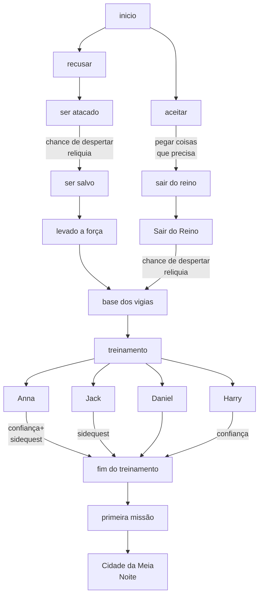

```mermaid
flowchart TB
A[inicio]-->B[aceitar]-->|pegar coisas<br> que precisa|C[sair do reino]
A-->D[recusar]-->E[ser atacado]-->|chance de despertar<br> reliquia| G[ser salvo]
G-->H[levado a força]-->I[base dos vigias]
C-->J[Sair do Reino]-->|chance de despertar<br> reliquia|I
I-->K[treinamento]
K-->id1[Anna] & id2[Jack] & id3[Daniel] & id4[Harry]
id1-->|confiança+<br>sidequest|L[fim do treinamento]
id2-->|sidequest|L
id3-->L
id4-->|confiança|L
L-->O[ganhar habilidade]
O[primeira missão]-->ad1[Cidade da Meia<br> Noite]
```
