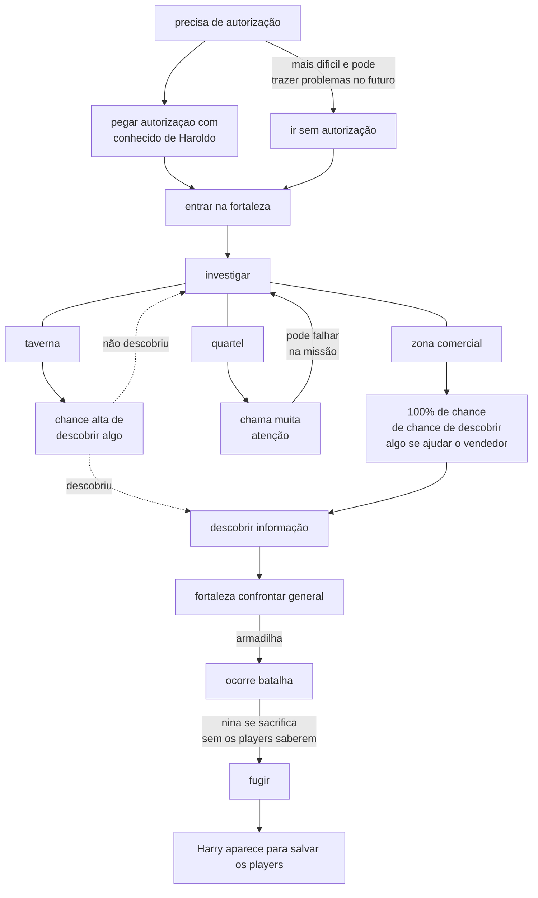

```mermaid
flowchart TB
A[precisa de autorização]-->B[pegar autorizaçao com<br> conhecido de Haroldo]
A-->|mais dificil e pode<br> trazer problemas no futuro|C[ir sem autorização]
B-->D[entrar na fortaleza]
C-->D
D-->E[investigar]---id1[taverna] & id2[quartel] & id3[zona comercial]
id1-->id1a[chance alta de<br> descobrir algo]-.->|não descobriu| E
id2-->id2a[chama muita<br> atenção]-->| pode falhar<br> na missão| E
id3-->id3a[100% de chance<br> de chance de descobrir<br> algo se ajudar o vendedor]
id1a -.->|descobriu| F[descobrir informação]
id3a --> F
F-->G[fortaleza confrontar general]-->|armadilha|H[ocorre batalha]
H-->|nina se sacrifica<br/> sem os players saberem|I[fugir]
I-->J[Harry aparece para salvar os players]
```
