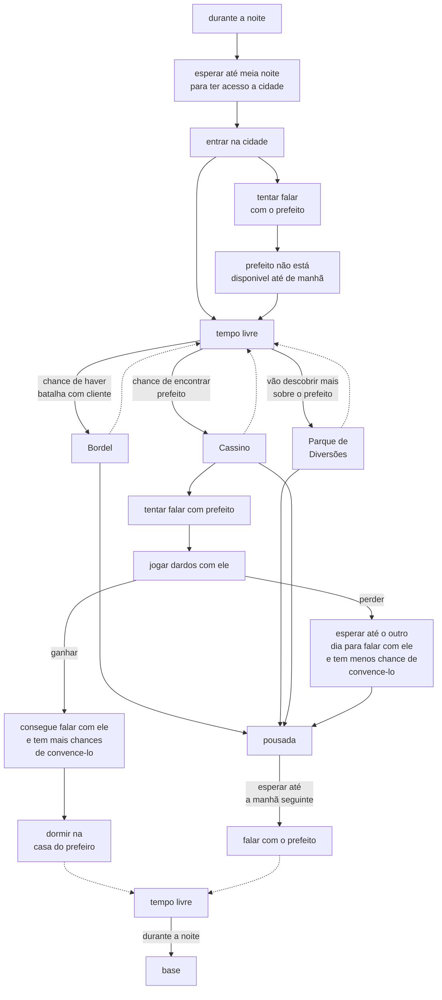

```mermaid
flowchart TB
A[durante a noite]-->B[esperar até meia noite<br> para ter acesso a cidade]
B-->C[entrar na cidade]-->D[tentar falar<br> com o prefeito] & E[tempo livre]
E --> |chance de encontrar<br> prefeito|F[Cassino]
E --> |chance de haver<br> batalha com cliente| G[Bordel]
E -->|vão descobrir mais<br> sobre o prefeito| H[Parque de<br> Diversões]
D -->I[prefeito não está<br> disponivel até de manhã] --> E

G & H & F -..-> E
G & H & F --> J[pousada]

F --> f1[tentar falar com prefeito]-->f2[jogar dardos com ele]
f2 -->|ganhar| f3[consegue falar com ele<br> e tem mais chances<br> de convence-lo]
f2 -->|perder| f4[esperar até o outro<br> dia para falar com ele<br> e tem menos chance de<br> convence-lo]

f4--> J

f3--> f3a[dormir na<br> casa do prefeiro]-.->L

J -->|esperar até<br> a manhã seguinte| K[falar com o prefeito]

K-.->L[tempo livre]-->|durante a noite|M[base]
```
