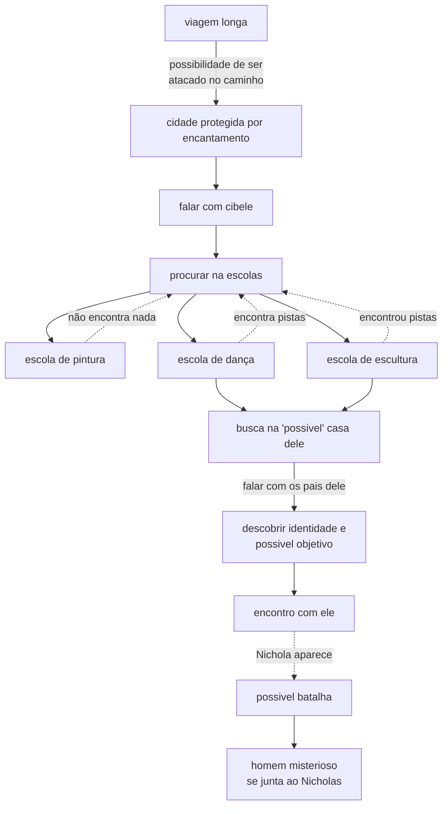

```mermaid
flowchart TB
A[viagem longa]-->|possibilidade de ser<br> atacado no caminho|B[cidade protegida por encantamento]
B-->C[falar com cibele]-->D[procurar na escolas]
D-->d1[escola de pintura] & d2[escola de dança] & d3[escola de escultura]
d2-.->|encontra pistas|D
d2-->E
d1-.->|não encontra nada|D
d3-.->|encontrou pistas|D
d3-->E[busca na 'possivel' casa dele]
E-->|falar com os pais dele|F[descobrir identidade e <br> possivel objetivo]
F-->G[encontro com ele]-.->|Nichola aparece|H[possivel batalha]
H-->J[homem misterioso <br> se junta ao Nicholas]
```
