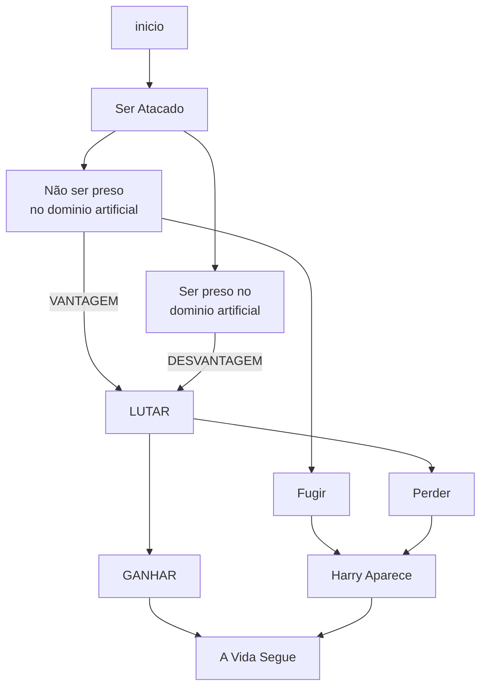

```mermaid
flowchart TB;
    A[inicio]:::PHASE-->B[Ser Atacado]
    B-->C[Não ser preso<br> no dominio artificial]
    B-->D[Ser preso no<br> dominio artificial]
    C--> |VANTAGEM| E[LUTAR]
    C---->F[Fugir]
    F-->G[Harry Aparece]
    D--> |DESVANTAGEM| E
    E-->H[Perder]-->G
    E-->I[GANHAR]-->J[A Vida Segue]
    G-->J
```
